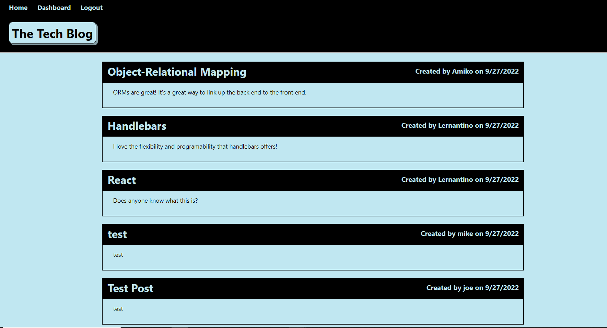

# Tech Mania

## Description

This is a CMS styled blogging website where the user can create an account, post short blog posts, and add comments to the posts. 

This was a great project that really tied in all of our learning topics thus far, it was challenging due to time constraints but I really enjoyed this project. 

This app utilizes node.js, express.js, and sequelize.

## Table of Contents
- [Installation](#Installation)
- [Usage](#Usage)
- [Contributing](#Contributing)
- [Testing](#Testing)
- [Questions](#Questions)
- [License](#License)

## Installation

Clone repo and deploy on hosting site.

## Usage
[Link to deployed site](https://techmania123.herokuapp.com/ "Tech Mania!")

## Contributing
### How to Contribute:

None.

## Testing

None.

## Questions

Here's my [GitHub Profile](https://github.com/DA-Mike/).
If you have any questions, please feel free to contact us at mike.rugh@gmail.com.

## License

This project is covered under [MIT](https://choosealicense.com/licenses/mit/).

Generated by Readme-Automaton
